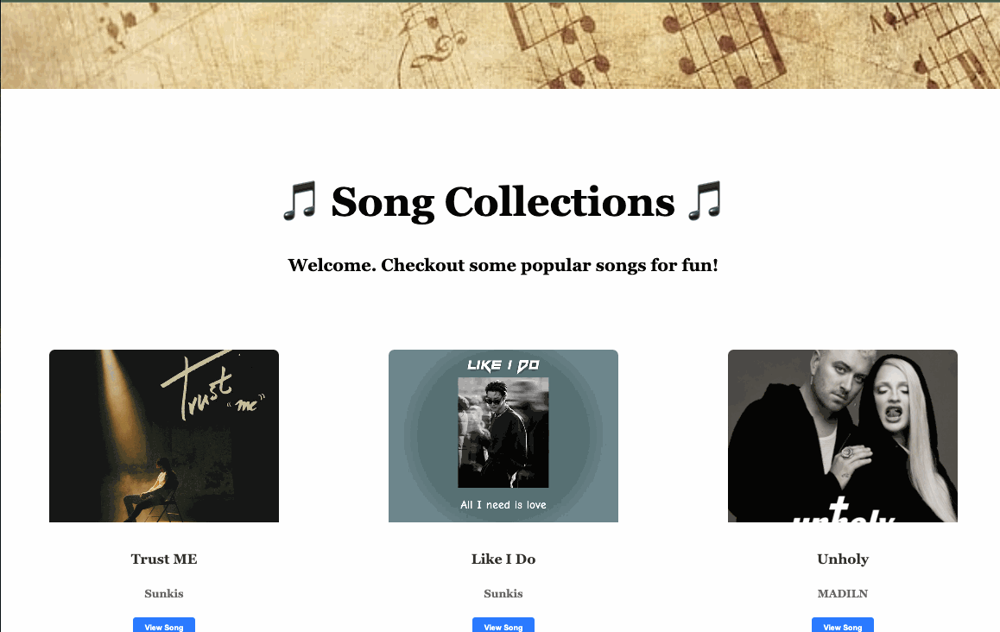

# Web Development Project 1 - *Community Board*

Submitted by: Emily Gao Wang
Total time spent: 6 hours

## Overview

This web app showcases community-relevant events and resources in a responsive card format, providing a user-friendly way to explore valuable content.

## Features

**Core Functionality**

- Displays at least 10 unique resources or events relevant to a specific community.
- Content is displayed in a responsive card format.

**Optional Features**

- Future integration of buttons or links to related resources on each card.
- The site is designed to be responsive for both desktop and mobile.

The following **additional** features are implemented:

* [ ] List anything else that you added to improve the site's functionality!

## Video Walkthrough

Here's a walkthrough of implemented required features:

<!-- Replace this with whatever GIF tool you used! -->
GIF created with LICEcap  
<!-- Recommended tools:
[Kap](https://getkap.co/) for macOS
[ScreenToGif](https://www.screentogif.com/) for Windows
[peek](https://github.com/phw/peek) for Linux. -->

## License

This project is licensed under the Apache License, Version 2.0. You may obtain a copy of the License at http://www.apache.org/licenses/LICENSE-2.0.
